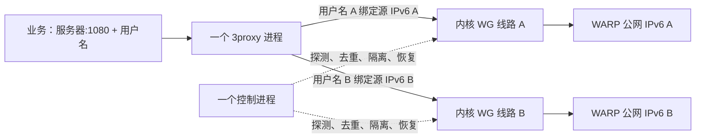

WARP Pool Next 0.2.0 是一个轻量 Linux WARP IPv6 代理池。推荐部署为一个 host 网络 Docker 容器，只有一个 SOCKS5 端口，通过不同用户名选择固定线路。每条线路使用一份独立 WARP 配置、一个内核 WireGuard 设备和源地址路由；整个池共享一个 Python 控制进程和一个 3proxy 进程。

提供 Linux amd64、arm64 成品镜像和原生二进制包，编译全部在 GitHub Actions 完成，VPS 只拉取和运行。源码、镜像及发布包不包含实际账号、私钥或密码。前一版原生服务已完成 120 条真实线路验证；容器运行的资源应按实际部署重新测量。

**单容器部署**

准备 Linux 内核 WireGuard。主机需要 Docker Compose；无需编译器。使用 `deploy/compose.yaml`，其中只有 `network_mode: host`，没有 `ports` 映射、Docker socket 挂载或 privileged 模式。代理使用容器内专门的 UID 41001，部署前确认宿主没有将同一 UID 用于其他业务。

将 Compose 文件放到自己的部署目录，例如 `/srv/warp-pool-next/compose.yaml`。先将已有 WARP 配置保存在 `/root/warp-profiles`，每份配置权限为 600，随后在部署目录运行：

```sh
docker pull ghcr.io/vcshixin/warp-pool-next:latest
docker run --rm --network none --read-only --entrypoint python3 \
  -v /root/warp-profiles:/profiles:ro \
  -v /srv/warp-pool-next:/output \
  ghcr.io/vcshixin/warp-pool-next:latest \
  tools/import_profiles.py --profiles-dir /profiles --output /output/config \
  --instance main --mode users --listen 0.0.0.0 --port 57603
docker compose run --rm --no-deps warp-pool-next --config /etc/warp-pool-next/config.json check
docker compose up -d
docker compose ps
docker compose logs --tail 30 warp-pool-next
```

客户端地址均为 `服务器:57603`，通过 `warp-0001`、`warp-0002` 等用户名选线，密码来自私有的 `config/clients.tsv`。不要把该文件或 `config`、`state` 目录提交到仓库。监听所有接口时，应根据自己的访问范围设置宿主防火墙。

容器健康检查每 60 秒读取轻量状态和确认监听，不会遍历所有线路重新探测。`healthy` 取决于配置的独立出口门槛；Docker 本身不会因为状态变成 unhealthy 就重建账号或换线。

升级可先把 `WARP_POOL_IMAGE` 固定为已核对的版本标签或镜像 digest，运行 `docker compose pull` 和 `docker compose up -d`。保留状态目录。默认禁用该容器的 Watchtower 自动更新，避免绕过有序停机和版本核对。Docker 收到停止请求后给服务 120 秒清理自己的网络资源。

**同一端口上的随机聚合入口**

在私有主配置中加入可选的 `random_users`：

```json
"random_users": [
  {"username": "warp-random", "password_file": "passwords/random"}
]
```

密码文件按普通线路密码的要求创建并设为 600。`warp-random` 使用同一个 SOCKS5 端口，在当前通过验证、去重且启用的线路之间按连接随机选择；普通线路用户名仍固定绑定原线路。聚合不是严格轮询，不保证短时间请求数完全均分；已经建立的连接不会因随机选择换线。整池不可用时拒绝连接，不回退宿主出口。

随机用户名不能与固定线路用户名重复；当前最多支持 1000 条候选线路和 32 个聚合用户名。可以热更新聚合账号和密码：

```sh
docker kill --signal HUP warp-pool-next
docker compose logs --tail 20 warp-pool-next
```

原来单独的 HAProxy 聚合入口可以由该随机用户名接管，无须增加第二个监听端口或第二个代理容器。

**自动构建与发布**

- `main` 的推送和 PR 在原生 amd64、arm64 runner 上执行测试、构建镜像并检查成品入口。
- 推送与源码版本一致的 `vX.Y.Z` 标签后，自动编译 3proxy、打包自带 Python 运行时的控制器，并发布 GitHub Release。
- 同一次发布生成 amd64、arm64 两份镜像，合并为 `ghcr.io/vcshixin/warp-pool-next:vX.Y.Z` 和 `:latest`。
- 版本发布工作流也可手动在已有版本标签上运行。已经发布的 Release 不会被脚本覆盖；应使用新版本标签发布修正。
- 下载的原生包包含控制器 ELF、运行库及 `bin/3proxy`；适用 glibc 2.36 或更新系统，仍需宿主提供 iproute2、wireguard-tools 和 CA。Docker 镜像自带这些用户态依赖，但仍使用宿主内核 WireGuard。
- Actions 及 Python 基础镜像按摘要固定；3proxy 原始源码在编译前校验 SHA256。发行压缩包附 SHA256 清单。

**为什么这样设计**

一个服务可以维护很多 WARP 隧道，无须每个出口各开一个容器。隧道、密钥、加密和保活的成本仍然存在，但不再重复创建容器管理进程、端口映射进程和巡检脚本。



账号配置数、隧道 IPv6 数、公网出口数是三个不同的数字。启动后会实际通过每条隧道访问 Cloudflare HTTPS trace，确认 `warp=on` 和公网 IPv6；重复出口只放行其中一条。默认 `exit_policy=follow_line`：用户名始终绑定同一条线路，公网 IPv6 变化后重新验证并去重，合格就继续使用该线路。不会因为换 IP 而自动换账号或换到其他线路。

**运行要求**

- Linux 内核支持 WireGuard、IPv6 源地址路由及 `ip rule uidrange prohibit`。
- Python 3.10 或更新版本、iproute2、wireguard-tools、系统 CA 证书、systemd。
- 3proxy 固定版本 1.0.0；可直接提取已校验的官方程序，无须编译。自行编译时才需要 C 编译器与 make。
- root 控制网络设备，3proxy 使用专门的非登录用户 `warpnext`。不能将代理设为 root，也不建议与其他服务共用 UID。
- 已有独立的 WARP WireGuard 配置，通常来自 wgcf。只支持每份一个 Peer、一个全局 IPv6 `/128`；主机原有 IPv4、IPv6 默认路由保持原有用途。

Debian/Ubuntu 可先安装：

```sh
sudo apt-get update
sudo apt-get install python3 ca-certificates iproute2 wireguard-tools
sudo modprobe wireguard
```

**原生 systemd 部署备选**

以下命令在解压后的项目根目录执行。安装工具只安装程序和服务模板，不自动启动、不自动启用开机启动、不修改防火墙，也不覆盖已有安装。

1. 准备 3proxy。Debian/Ubuntu 的 ARM64 和 x86-64 可直接提取官方发布程序，工具使用预先固定的 SHA256 校验，不会执行 deb 包里的安装脚本。

```sh
python3 tools/prepare_3proxy.py --output ./prepared-3proxy
sudo python3 tools/install.py --proxy-binary ./prepared-3proxy/3proxy
```

也可使用 `--archive /path/to/3proxy-1.0.0.arm64.deb` 离线提取对应架构的官方包。需要自行构建时，先安装 `build-essential`，再执行 `python3 tools/build_3proxy.py --output ./build-3proxy`，将生成的 `./build-3proxy/3proxy-1.0.0/bin/3proxy` 传给安装工具。源码构建默认只用一个编译线程；这条路径作为兼容备选，本轮服务器运行验收使用的是官方 ARM64 程序。

2. 将准备好的配置放在一个私有目录内。配置文件权限须为 `600`，目录建议为 `700`。输入目录中的每份配置都会成为候选线路；重复私钥或重复隧道 IPv6 会直接拒绝。导入不会启动隧道或注册账号。

```sh
sudo python3 /opt/warp-pool-next/tools/import_profiles.py \
  --profiles-dir /root/warp-profiles \
  --pattern '*.conf' \
  --output /etc/warp-pool-next/main \
  --instance main --mode users --port 1080
```

如果输入是 `accounts/001/wgcf-profile.conf` 这种结构，使用 `--pattern wgcf-profile.conf`。默认按文件路径排序编号，从 1 开始。生成的 `import-map.json` 保存原文件与新线路编号关系，`clients.tsv` 保存客户端连接参数和密码，均为私有文件。

默认 `min_unique_exits` 等于导入数量：只要存在重复或失败，状态就会显示未达到整体就绪门槛；已经验证的线路仍可单独使用。也可以通过 `--min-unique-exits 100` 指定实际需要的独立出口数量。需要留出少量候选线路以容纳重复或不可用账号，不能直接把门槛调低当作补足了出口。

3. 检查配置，然后启动。

```sh
cd /opt/warp-pool-next
sudo python3 -m warp_pool --config /etc/warp-pool-next/main/config.json check
sudo systemctl start warp-pool-next@main
sudo systemctl status warp-pool-next@main --no-pager
sudo python3 -m warp_pool --config /etc/warp-pool-next/main/config.json status
sudo journalctl -u warp-pool-next@main -n 40 --no-pager
```

首次启动要逐条创建并验证隧道，`systemctl` 的 active 只表示控制进程启动；应同时核对状态里的 `unique_exits`、`ready` 和各条线路的 `available`。`check` 只校验本地配置，不能证明网络可用。确认运行合适后再执行 `sudo systemctl enable warp-pool-next@main`。

默认监听 `127.0.0.1`。远程客户端需要将 `listen` 改成实际监听地址，并按自己的网络设置允许入口；`0.0.0.0` 表示所有 IPv4 接口。一个实例使用一个监听地址，客户端至代理的地址类型与代理至网站的 IPv6 出口相互独立。可通过现有私有网络或 SSH 转发访问；SOCKS5 用户名密码认证本身不提供链路加密。

**客户端怎么填**

客户端使用普通 SOCKS5 即可；不同用户名固定选择不同出口，不需要专用客户端。

| 项目 | 示例 |
|---|---|
| 类型 | SOCKS5，域名交给代理解析 |
| 地址 | 服务器地址，或本机转发地址 |
| 端口 | 1080，所有线路相同 |
| 线路 1 用户名 | warp-0001 |
| 线路 2 用户名 | warp-0002 |
| 密码 | 对应 `clients.tsv` 中生成的密码 |

curl 可将真实凭据保存进权限为 `600` 的客户端文件，避免放进命令行参数：

```text
socks5-hostname = "127.0.0.1:1080"
proxy-user = "warp-0001:替换成该线路的密码"
```

```sh
curl --config /path/to/private-client.cfg https://cloudflare.com/cdn-cgi/trace
```

**两种入口的选择**

| mode | 如何选线 | 适用情况 |
|---|---|---|
| users，默认 | 一个端口，不同用户名 | 常驻线程与监听端口最少；建议用于新部署 |
| ports | 每个端口对应一条线路 | 兼容已有以端口识别线路的客户端；允许多个端口共用同一组用户名密码 |
| both | 同时提供上述入口 | 验证或过渡；常驻成本接近多端口方案 |

多端口导入可用 `--mode ports --port-base 20000`，第一条端口为 20001。`--shared-password-file /path/to/private-password` 可让 ports 模式共用用户名 `warppool` 与同一密码。若要保留旧端口例外或旧用户名，应在启动前根据 `import-map.json` 修改生成的配置；导入程序不会猜测旧业务绑定关系。`users` 和 `both` 的用户名必须唯一。

**配置和运行策略**

完整字段示例在 `examples/config.json`；其中的 profile 和 password_file 是占位路径，需用真实导入文件替换。路径相对主配置目录解析。

| 配置 | 默认值与含义 |
|---|---|
| health_interval | 300 秒，错峰执行完整的 HTTPS 出口探测 |
| exit_policy | follow_line，固定线路，允许验证并接受新 IPv6；fixed_ip 则要求公网 IPv6 不变 |
| repair_interval | 30 秒，批量检查设备、Peer、源地址、路由和隔离规则 |
| probe_workers | 4，探测最大并发 |
| probe_timeout | 8 秒，每次网络操作超时；可能尝试两个目标地址 |
| failures_before_down | 2，连续网络探测失败后摘除；出口变化与重复不等待此次数 |
| max_connections | 1024，代理全局连接数限制 |
| per_port_connections | 64，ports/both 每个独立端口的限制 |
| min_unique_exits | 整体就绪所要求的独立出口数；不改变单条线路放行规则 |
| table_base / rule_base | 61000 / 20000，分别与线路 id 相加；会检查与宿主已有资源的冲突 |
| dns_server | 1.1.1.1，用于代理端域名解析；目标连接只允许 IPv6 |

每个接口 MTU 1280，保活 15 秒。源地址路由表带有拒绝默认路由；线路关闭或待验证时，额外以代理 UID 实施内核隔离。正常的网卡/路由修复保留 WireGuard Peer、UDP 端口及 endpoint，避免无必要地重建会话。设备被删除时仍需重新创建，公网出口是否保持由 Cloudflare 决定。

控制器批量读取网络状态，平时不会逐条执行 Docker 命令，也不会在每次探测中启动 curl。导入、注册与正常运行分开，本包没有自动注册或自动换号逻辑。

**更新、停止与故障处理**

修改前保留原配置及密码文件的私有备份。密码可以换成新文件并更新 `password_file`；`enabled`、`exit_policy`、`expected_exit`、探测周期和连接限制可热更新。改变出口策略会先关闭相关线路，并重新探测后放行。线路 id、用户名、私钥/公钥、隧道源地址、endpoint、监听地址/端口、模式、代理 UID、路由范围、工作线程数须正常停止后修改并重启。

```sh
sudo systemctl reload warp-pool-next@main
sudo journalctl -u warp-pool-next@main -n 20 --no-pager
```

非法配置会记录 `configuration_reload_rejected`，原配置继续运行。发送 reload 信号的命令返回不等于已验证成功，应核对日志与实际连接。发布过程中若出现磁盘/网络错误，服务会退出并清理自身资源，不会谎报已经回滚。

凭据更新使用 3proxy `SIGUSR1` 与 `noforce`，已建立的转发连接可以继续，新的连接使用新凭据。故意停用线路时，内核会阻断该线路的后续流量；两者目的不同。重新启用必须先经过新探测。代理子进程异常退出时会重建；一分钟内连续退出超过三次则让整个服务退出，由 systemd 按有界重试策略处理。

```sh
sudo systemctl stop warp-pool-next@main
sudo systemctl start warp-pool-next@main
```

正常停止会先关闭代理，再移除本实例拥有的设备和规则；持久化的 pins、transport、配置、密码与账号文件保留。不要删除 `state_dir` 来“修复”异常，否则会丢失出口约束和网络归属记录。异常强杀后，使用相同实例、UID 和配置重启可核对并接回本实例的资源；如果要改拓扑，应先用原配置启动并正常停止。

常用状态文件：`status.json` 是展示信息，可能滞后，应配合 systemd 实际存活状态；`pins.json` 在默认策略下保存最近验证的公网 IPv6，在 `fixed_ip` 策略下保存必须保持的 IPv6；`transport.json` 保存 UDP 端口和 endpoint；`network.json` 是网络资源归属清单。不要人工修改这些记录来绕过故障检查。重复的 IPv6 即使探测成功，也不会同时放行。只有选择 `fixed_ip` 或为某条线路明确设置 `expected_exit` 时，出口变化才会因 `exit_changed` 被隔离；明确的 `expected_exit` 优先于全局策略。

首次安装脚本拒绝覆盖 `/opt/warp-pool-next` 或已有 systemd 模板。升级时先在独立目录验证新代码并备份旧代码与状态，再安排停止、更新程序、检查和启动；不要把新程序直接覆盖到正在运行的目录。服务模板将可写范围限制为实例状态目录与运行目录，若自定义状态路径，需要一并调整 systemd 的可写路径设置。

**实际边界**

- 只提供 SOCKS5 TCP CONNECT，不支持 UDP ASSOCIATE、BIND、HTTP 代理或透明代理。
- 拒绝 IPv4 目标、IPv4 映射地址、仅有 A 记录的域名及回环/私网等目标。隧道底层可使用 IPv4 UDP 连接 Cloudflare，这不会把网站出口变成 IPv4；DNS 也不是代理网站的出口。
- 固定的是“用户名 → 线路”关系。Cloudflare 不承诺永久静态或专属公网地址；默认验证并接受同一线路的新 IPv6。探测只能在下次检查时发现外部变化及重复，不能保证两次检查之间瞬时识别，也不代表该 IP 全球只有你使用。
- 3proxy 在有流量时通常每连接一个线程；集中监听降低的是常驻成本。大量真实并发仍会消耗线程、内存与加密 CPU，需结合实际业务调整连接数限制。
- 目前按配置接受最多 2048 条候选线路，这是校验范围，不能视为已做过 2048 条容量验收。实际实测范围见配套报告。
- 健康探测依赖 Cloudflare HTTPS trace，失败会重试；代理 DNS 依赖所配置的 DNS 服务。没有引入多节点控制平台、面板或分布式注册服务。
- 生产迁移需核对旧端口、凭据、账号固定绑定、HAProxy/watchdog 控制权及业务可达性。同一 WARP 私钥不要在新旧实现中并行建立活跃隧道。旧配置和容器应保留供回退；本项目不会自动迁移或删除它们。

本地配置与状态机验证：在项目根目录运行 `python3 -m unittest discover -s tests -v`。网络隔离、真实出口、热更新、故障恢复与资源数据来自甲骨文独立实验，详见配套报告。
